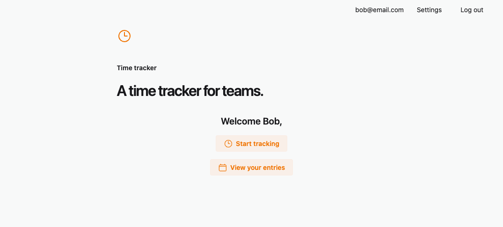
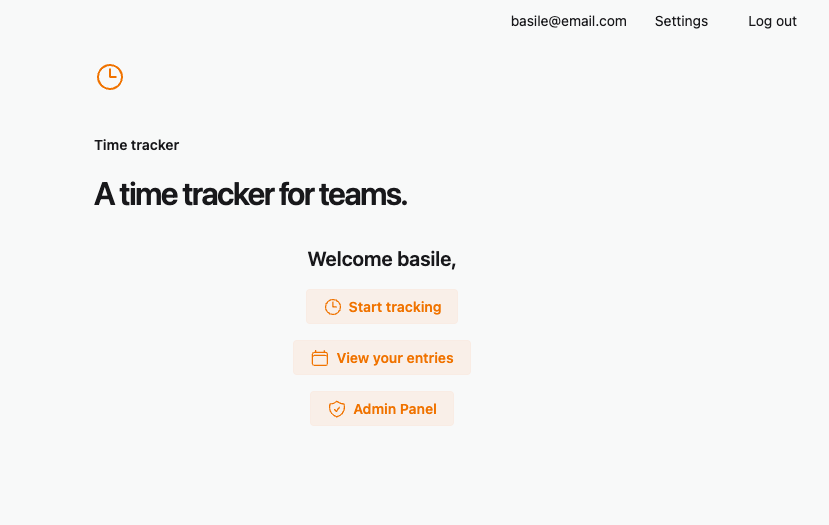

# Track

A time tracker for busy teams.

Admin view:

## Getting Started

You will need `mise` to install the tools.
You will need a postgres database running on `localhost:5432`. We recommend using a docker container or Postgres.app (on macOS).

Once you have these, start your Phoenix server:

- Run `mise install` to install the tools
- Run `mix setup` to install and setup dependencies
- Start Phoenix endpoint with `mix phx.server` or inside IEx with `iex -S mix phx.server`

Now you can visit [`localhost:4000`](http://localhost:4000) from your browser.
